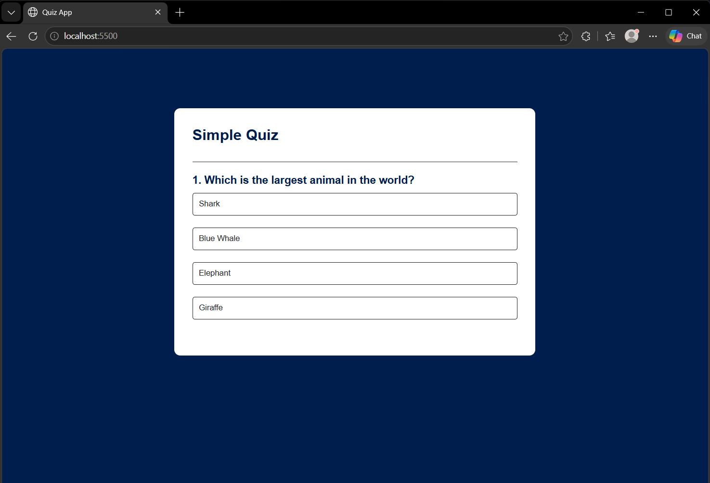

# Simple Quiz Application

A lightweight, interactive Quiz Application built with modern **TypeScript**, HTML5, and CSS3. The project demonstrates how to structure modular frontend code using ES Modules and manage type safety with TypeScript.

## 🚀 Features

* **Dynamic Question Rendering:** Pulls questions dynamically from an isolated data module.
* **Instant Feedback:** Automatically highlights correct and incorrect answers upon selection.
* **Score Tracking:** Tracks user performance and displays a summary at the end of the quiz.
* **Restart Functionality:** Seamlessly resets state to allow playing again without page reloads.
* **TypeScript Powered:** Uses strict type configurations to prevent common runtime DOM errors.

---

## 📷Screenshot 
### Question Page


### Score Page


## 🛠️ Project Structure

```text
├── dist/                  # Compiled JavaScript production files (automatically generated)
├── src/
│   ├── questions.ts       # Quiz data and questions array
│   └── script.ts          # Main application logic & DOM manipulation
├── index.html             # Application entry point
├── style.css              # Custom styling and UI transitions
├── tsconfig.json          # TypeScript compiler configuration
└── package.json           # Node dependencies and scripts